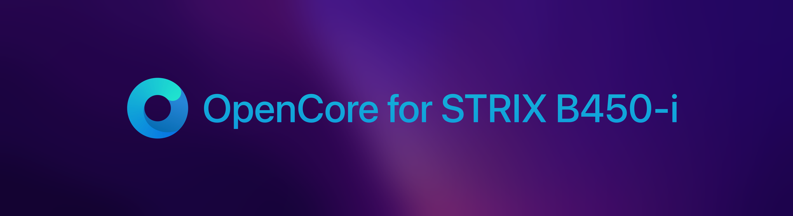

	

Tested with macOS 12.3 – later versions have not been tested. This EFI is my personal configuration and is not 100% guaranteed to work with your hardware... but is intended to be used as a reference point to get your hackintosh up and running. Feel free to join the [Telegram](https://t.me/macOSstrixB450i) chat for discussion. Please note that you'll need to [flush a new SMBIOS](https://dortania.github.io/OpenCore-Install-Guide/AMD/zen.html#platforminfo) if you wish to use iCloud services. The included SMBIOS is intentionally blank.

If you're able to, please consider [donating directly to AMD OS X!](https://forum.amd-osx.com/index.php?dbtech-donate/drives/amd-os-x.1/donate) Without the talented team and forums, this fun would not be possible. 

## BIOS Settings

Tested with BIOS 4602 (September 2021) - try upgrading to this version before troubleshooting any issues.

**Boot**

* Fast Boot → Disabled
* CSM → Launch CSM → Disabled
* Secure Boot → OS Type → Windows UEFI

> Set OS Type to "Other" if you're having issues booting the macOS installer.

**Advanced**

* USB Configuration → XHCI Hand-off → Enabled

* Core Performance Boost → Disabled

> For Ryzen G CPUs only - helps reduce audio crackling but **won't** fix it.

## Reference Specifications

* **Motherboard:** Asus Strix B450-I
	* LAN: Intel I211-AT
	* Audio: SupremeFX S1220A
	* Wireless: Realtek 8822BE
	* Bluetooth: Laird BT852 (USB)
	* SSD: Sabrent Rocket 1TB NVMe

* **Processor:** AMD Ryzen 5 2600X
* **Graphics:** Sapphire Nitro+ AMD Radeon RX 580 8GB

## Known Issues

**Internal WiFi & Bluetooth is not working.**

* **Fix:** The internal wireless card can be replaced with one that is compatible with macOS.

**Discord stuck in a crash loop.**

* **Fix:** [Solution](https://discord.com/channels/249992304503291905/283346899799638016/953634716479799297) (Opens AMD OS X Discord, highly reccomend being part of this server!)
